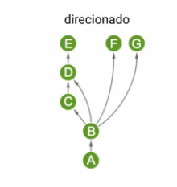
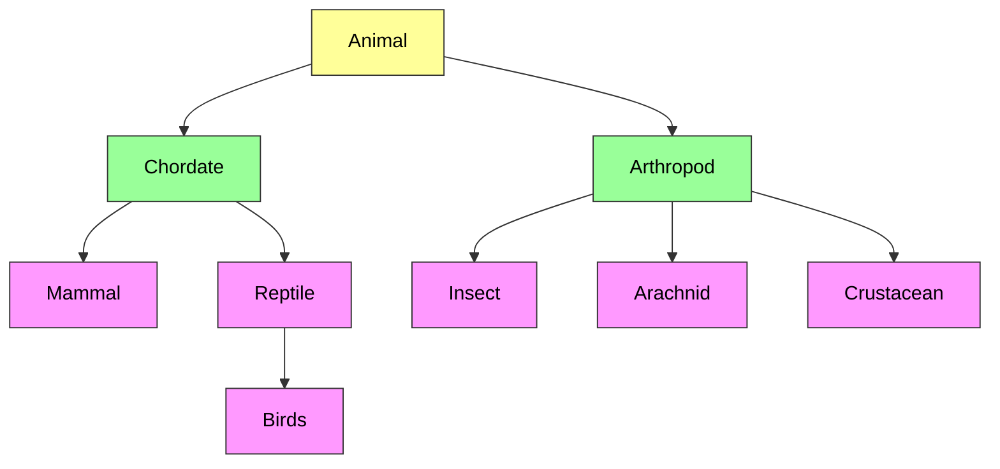

# Árvore Filogenética dos animais

## Introdução
Esse repositório é um exercício sobre grafos e sua utilização na programação. Aqui apresento como grafos direcionais assemelham-se com objetos de um programa orientado a objeto, onde temos objetos que herdam caracteristicas de um objeto pai. Nesse exercício utilizei um exemplo de algumas partes da árvore filogenética do reino dos animais.

Lembrando que árvore filogenética é muito mais complicado do que foi apresentado nesse trabalho. Esse foi só um exemplo para explicar como grafos direcionais podem ser estudados para formatação de programas orientados a objetos

### 1. Explicar o contexto da aplicação
Organização de Objetos dentro de um programa. A Programação Orientada a Objeto (POO) teve como objetivo aproximar o manuseio das estruturas de um programa ao manuseio de coisas (pessoas, objetos, animais, estruturas, etc) do mundo real. O POO utiliza de uma mecanica chamada de **herança** para que objeto herdem caracteristicas de outros objetos "pai". Assim podemos ver influência na grafos direcionais.

### 2. Descrever como o grafo é modelado
Se observar na sessão de **Modelo gráfico do grafo**, o modelo que foi organizado semelha-se a um grafo direcionado, onde temos as vertices que são os objetos, como *Animal*, que fazem herança com seus filhos, como *Animal* para *Chordate*. 

Como observado no arquivo [kingdom](./kingdom.js) temos uma classe animal que entra com seus atributos: *name*, *kingdom*, uma lista de caracteristicas chamada *characteristics* e três funções: uma para adicionar caracteristicas, *addFeature()*, outra para remover caracteristicas, *removeFeature()*, e a ultima para fazer polimorfísmo, *polymorphism()*. 

Os filhos de *Animal* possuiram suas características aparti da declaração "*extends animal.Animal*" junto com a função *super()* dentro do *contructor()* do filho. A função *super()* que efetivamente trará as características da classe pai. 

Classes filhas herdam caracteristicas das classes pais, podem remover, adicionar e modificar elas, no POO chamamos de polimorfísmo. Ex: um *Arthropod* contem 3 segmentos do corpo: cabeça, tórax e abdômen, mas *Arachnid* juntaram cabeça e tórax formando um corpo com 2 segmentos: cefalotórax e abdômen.
### 3. Refletir: Por que essa aplicação depende da estrutura de grafos?
Grafos são estruturas que representam entidades (nós) e suas relações (arestas). Em POO, classes e objetos têm relacionamentos, como: associação, agregação, composição e herança, que podem ser mapeados como grafos. Isso ajuda na compreenção e visualização como os objetos se conectam e interagem entre si.

Aqui utilizamos um exemplo de árvore filogenética, mas poderia ser em um aplicativo de rede social em que temos objetos de classe *User*, *Manager* e uma classe de generalização, ou classe pai, *Person*. *User* e *Manager* herdando certas ou todas as características de *Person*, *User* fazer relação com outros objetos *Users* e *Manager* gerenciar o aplicativo, com devidas autorizações.

Existem bastante aplicações para POO e grafos são essenciais para o estudo da estrutura de relacionamento desses objetos.

## Modelo gráfico do grafo

## Linguagem utilizada

## Referências
* [Guia do Estudantes enem](https://guiadoestudante.abril.com.br/curso-enem/infografico-a-arvore-da-vida-mostra-o-parentesco-entre-todos-os-seres-vivos)
* [Alura - O que é POO](https://www.alura.com.br/artigos/poo-programacao-orientada-a-objetos?srsltid=AfmBOor8C6jnVgQCe2vl_0JGGHQ5JGHhEQ_-cs8cyaVouQqKQaz_GX_C)
* [Medium - Grafos #2 Diferentes tipos de grafos com exemplos práticos](https://medium.com/@rsorage/grafos-2-diferentes-tipos-de-grafos-com-exemplos-práticos-e4646c4f1ce2)
